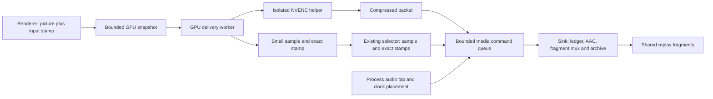

# Renderer GPU recording

The recorder connects the renderer boundary to the GPU delivery worker, an
isolated NVIDIA encoder, and the existing input/audio/fragment system. It is
the one shipped capture path (the legacy ReadScreen/frame-stream path was
deleted on 2026-09-16 at his decision); without the installed layer the
recorder photographs the desktop with no stamps. Griffin accepted the
round-48 build live on 2026-09-16: "No lag. No stuttering. Replay is
smooth. Input timeline matches."

Component contracts live beside this page:
[renderer boundary](replay-renderer-boundary.md) (SourceV2 surface and stats),
[GL snapshot](replay-gl-snapshot.md), [LINK state](replay-link-state.md),
[GPU bridge](replay-gpu-bridge.md), [capture control](replay-capture-control.md)
(the control page and lease) and [the renderer build](../renderer/README.md).

## Why it is built this way

- **The picture is taken inside the renderer.** Window or desktop capture
  (Windows Graphics Capture, desktop duplication) stamps a picture with wall
  time but cannot say which N64 frame it shows, and does not promise every
  picture; a `SwapBuffers` hook sees swaps, not game frames (a frame can
  present none, several, or hold the last picture). Only the renderer knows,
  as `ProcessDList` ends, which game frame and which input it just drew, so
  the stamp and the picture are taken together there.
- **The renderer is a source build of LINK's GLideN64 v4.2.** It is the
  renderer his Project64 1.6 install already ran, so picture, smoothness and
  settings stay as he knows them. Stock GLideN64 offers only a synchronous CPU
  `ReadScreen`, and an earlier binary adapter depended on exact bytes and
  private offsets of one DLL. The rebuilt baseline passed his A/B (round 30):
  "same picture, smoothness and clean audio".
- **The game never waits for capture.** Unaffected emulation is his highest
  acceptance priority (round 21). The emulation thread already waits on
  renderer commands, so any capture wait would block the game; fixed pools
  refuse instead, and a refused picture is a counted gap, never a stall.
- **Passive until asked.** His requirement (round 22): with the server off the
  plugin behaves as LINK does, and capture turns on without switching plugins
  or restarting Project64. A lease with a deadline covers a hung owner; PID
  plus process birth time covers a crashed one or a reused PID.
- **Encoding happens in a separate 64-bit process.** Project64 and the plugin
  are 32-bit, 32-bit CUDA is unavailable on RTX 50-series cards, and NVENC has
  no OpenGL input on Windows. Pictures therefore cross from GL into a D3D11
  shared texture that a 64-bit helper encodes. The helper lives in its own
  kill-on-close job so a stuck driver call can be ended without restarting the
  server.
- **Only small things reach Python.** Selection samples, stamps and compressed
  packets; media persistence runs on its own sink thread. Capture credits held
  across AAC, SQLite or a slow timer drained the source pool (rounds 37, 48).
- **One capture route.** His decision, 2026-09-16: "Delete the CPU path." That
  route carried the synchronous `ReadScreen` barrier. The desktop grab remains
  only for a machine or moment without the layer, and says so.
- **The practice ROM is decided natively.** A real run must see plain GLideN64
  even with no trainer open, so the wrapper reads the cartridge header itself
  (below).
- **The stride-8 selection sample stays.** It matches the accepted duplicate
  and settling decisions, and picture identity is preserved. A change confined
  inside one 8x8 cell can hold the previous picture; removing the sample needs
  renderer-certified picture identity (rounds 39, 48).

## Shipped files and how they are built

| File | Role | Built by | Build id suffix |
|---|---|---|---|
| `GLideN64_SM64Trainer.dll` (label `LINK v4.2 [SM64 Trainer]`) | the renderer: LINK's GLideN64 v4.2 at the pinned commit plus the SourceV2/ContextV1 overlay from `plugin/gfxwrap/` | `tools/build_renderer.py` (pin, credits and the prebuilt-library recipe in `renderer/`) | `-renderer` |
| `sm64_trainer_gfx.dll` (label `SM64 Trainer v1.0`) | the capture wrapper Project64 selects; loads the renderer named by `sm64_trainer_gfx.ini` | `tools/build_plugin.py` | `-gpu-runtime` |
| `SM64GpuEncoderV1.dll` | the 64-bit NVENC helper the server's isolated encoder process loads | `tools/build_plugin.py` | `-gpu-encoder` |

All three live in `src/sm64_events/data/plugin/` and are packaged by
`tools/build_exe.py`. Each carries an embedded build id naming the exact
sources it came from; `tests/test_bundled_natives.py` fails when a bundled
file and the tree disagree, and the setup screen compares an installed file
with the bundled one by that id (`core/capturelayer.py::_files_match`), so a
rebuild of unchanged sources never reads as "differs from this build". The
setup screen installs the renderer and the wrapper together, writes the ini
to name the renderer, selects the wrapper, and remembers the plugin it
replaced (`previous_graphics_dll`) for Remove. The wrapper's About box
credits GLideN64's authors and links the published source (GPL-2.0).

Practice ROM gate: at RomOpen the wrapper reads the cartridge header
(`plugin/gfxwrap/practice_rom.h`, mirrored by `core/onboarding.py::is_practice_rom`
and compared in `tests/test_practice_rom.py`). On any other ROM every callback
forwards straight to the renderer with no stamp adapter or per-call timing,
the control page reports `rom_baseline` with `rom_open` false so no lease can
activate capture, and the renderer overlay observes nothing and leaves
GLideN64's raw GL function table untouched. The server mirrors it: the poller
refuses a positively identified non-practice ROM and the recorder's capture
gate records nothing while it does. The idle control, delivery and log
threads created at InitiateGFX stay asleep.

Swapping ROMs needs no restart of either side. Project64 1.6 copies the new
cartridge's header into the buffer `GFX_INFO.HEADER` points at before every
RomOpen (`Cpu.cpp` StartEmulation and Machine_LoadState, which also calls
RomClosed/RomOpen around a state load), so the wrapper classifies each open
afresh. RDRAM is neither cleared nor released between ROMs, so the server
cannot see a swap in game memory: the poller reads the header before the
detectors whenever the timer goes back and at least every
`PRACTICE_ROM_CHECK_S`, and re-offers a refused cartridge every
`PRACTICE_ROM_RETRY_S`. `Pj64Memory.rom_header` remembers where it found the
image, because Allocate_ROM releases the old image before allocating the next:
a steady check is one 0x40-byte read (`tests/test_pj64_rom_header.py` drives
that against a real process; `tests/test_poller.py` drives the whole swap cycle).

Updates: when the user clicks Update in the app, the new build restarts and
`CaptureLayer.refresh_if_stale` (at boot and every two seconds) copies the
new renderer and wrapper over the installed ones as soon as Project64 is
closed, keeps the ini pointing at the renderer, and records the new hashes.
It refreshes only an install the trainer made itself (the installed wrapper
hash matches its receipt); a wrapper someone else copied in is left alone
and the setup screen asks. The status field `automatic_update` tells the UI
which case it is, and onboarding never reopens for an automatic update.

## Owners and data flow

`SourceFactory` is called only after `ReplayRecorder` acquires the machine-wide
recorder lock. GPU discovery reads the small control page. The paired
`GpuCapture`/`GpuSink` shares one capture coordinator and one bounded media sink;
it starts no second encoder. Existing recordings and fragment readers keep
their existing format and exact source-key lookup.

The renderer submits its copy and immutable occurrence/QPC/stamp without waiting
for GPU completion, the delivery worker, the encoder, Python, or disk. Pool
exhaustion refuses admission; it cannot turn into a renderer wait. A refused
stage or a full snapshot pool is a **counted missing picture** (`refused` in
the `gpu_summary` log line), never a run failure: the replay holds the
previous picture and the input lanes show the polled fill for those frames.
Before round 48 one refusal ended the run and the retry gate withheld 10-60 s
of footage. The next captured picture carries `lists_since >= 2` and is filed
inexact, so no false exactness enters through an omission. GPU commands
still consume bandwidth and share the driver with the game. Unnoticeable live
contention is a measured acceptance requirement, not a guarantee implied by the
absence of explicit waits.

The delivery worker owns context preparation, GPU fence polling, WGL/D3D transfer,
orientation/crop and small selection samples. Only small samples, stamps and
compressed packets reach Python. The helper owns synchronous native encoder and
shared-key operations inside a private kill-on-close process job. Its independent
watchdog can end a stalled helper without entering an emulation callback.

`GpuDemand` separately owns the capture lease. It never performs media or GPU
operations. A stopped server's lease expires independently of Python's media
worker. With no demand the native worker is passive and the renderer runs as
the original single-context renderer: the never-current shared GL anchor the
worker leases is published on the renderer thread at the first admitted
capture surface (`EnsureAnchor`), once per context, never at ROM open. A
direct or server-off session therefore creates no extra driver context
(round 48). The cost moves to the first captured frame after a server
attaches. Whether this or the same day's driver update ended the passive
stutter is not isolated (see [what failed](#what-failed-and-why)).

The media worker's tick is a high-resolution waitable timer plus the native
producer's own event (`tickwait.py`): a `threading.Event.wait(0.004)` sleeps
15.5 ms on Windows, three of which per picture drained the eight-slot source
pool on any short stall. Packet reservations shrink to the encoded size when
the packet returns, and the pending budget admits every native slot at once.

A true pause (F2, AFK) freezes the committed video end. Silence is padded only
up to that end and stamped there, so it muxes at once instead of piling PCM
against the frozen frontier; PCM ahead of the frontier waits, bounded by
capacity, and is not counted stale. `tests/test_gpu_audio_pause.py` pins
eight synthetic frozen seconds with no failure. With continuous real
callbacks (proctap zeros) the PCM capacity (about 5.5 s) still ends the run
explicitly; a typed paused-frontier seal remains the next step.

## Startup, idle and failure

The paired GPU sink is bound before audio startup, but GPU demand starts only
after primary/fallback audio initialization finishes. This keeps cold audio
setup outside the active native queue and lease deadlines. Early PCM is dropped
before the media handoff exists; the first source offer still owns the origin.
Stop/pause during setup is reconciled before video demand. The desktop grab's
sink keeps its video-before-audio startup order.

Preparation publishes the fresh request identity and BOOTSTRAP state before
acceptance returns. Channel names and shared resources become available while
the source remains metadata-only. The helper completes Open and the sink prepares
its AAC context, filter and mux format before the client publishes `encoder_ready`;
only then can picture admission begin. Preparation emits no dummy audio or media
header and assigns no clock. The first real offer establishes the media origin.
Its bind command creates the archive on the sink, leaving capture free to consume
the next offers. Startup cannot fill a source queue with cold codec construction.

Helper Open also settles WHICH CODEC this adapter records in. The session asks
for AV1 first — 32% of H.264's bytes at equal quality and faster to encode
(measured 2026-09-20) — and the encoder checks `nvEncGetEncodeGUIDs` before it
configures anything. An adapter without an AV1 encoder answers `GBDLL_CODEC`,
typed apart from every real fault, and the session opens again asking for
H.264 inside the SAME startup budget; `gpusettings.py` remembers the refusal
per adapter LUID, so only the first capture of a launch pays the extra round
trip. The codec that actually opened is what `PacketFragmentMux` writes the
fragments as, so an `av01` track is never described as `avc1`.

The lease supervisor allows five seconds from admitted request to ACTIVE. Helper
Open uses its startup budget; ordinary native requests use the shorter call
deadline. An unavailable backend ends the request explicitly. Transient failures
retry only after proved cleanup, with 10/20/40/60-second capped delays. A short
productive prefix or capability refresh does not waive the delay. Discovery,
storage-maintenance and audio-worker faults have their own bounded retry delays.
New process identity and observed normal ROM lifecycle permit a fresh request.
Native reason9 (resources exhausted) is process-lifetime sticky: the user must
fully close and reopen Project64. A ROM reload/control generation change cannot
prove recovery, so the retry gate retains that refusal for the same process birth.

Failed cleanup retains its original owner and retries closure before admitting
a replacement. GPU media closure stays on its owning media thread. A completed
publication failure differs from a still-running writer. Unproved native lease
closure remains quarantined; repeatedly clearing an error flag cannot establish
that a lost native owner is safe. This path may still require manual recovery.
Windows unmap/close and mutex-release return values are checked individually.
A partial constructor transfers its surviving owner to the supervisor; a failed
release retains that same handle and original mutex-owning thread for retry.
The control retains a birth-verified process handle: only its signaled state
proves PJ64 exited. Access/wait errors never substitute for exit evidence.
Server shutdown joins the packaged plugin-refresh worker before closing its
passive setup observer. Permanent release failures remain explicit pending
cleanup; tests do not claim that a stuck driver can be safely force-released.
`/api/replay/status` exposes `recovery` and `audio_health`, including error and
retry timing. A failed audio worker restarts after its old callbacks stop;
timestamped sinks retain their original video clock. The in-process writer
used only without an ffmpeg binary closes its run at an audio gap instead of
shifting subsequent samples.

Python cleanup does not prove that the native worker has finished retiring its
source transactions and GPU ownership. A new request arriving during that drain
remains PREPARING with the same identity. The independent watchdog retries
admission within the existing setup deadline; it does not read the old run's
terminal status as the new run's result. Cancellation or ROM closure invalidates
that pending request. Invalid, exhausted and system-error admission remain
distinct permanent refusals. Intentional metadata-only bootstrap observations
remain valid if their completed records arrive just after ACTIVE is published.

Failure logs retain raw numeric codes and decode their native namespace through
`gpudiagnostics.py`. Distinct source failure codes separate missing images,
invalid records/stamps, client rejection, epoch changes and refused admission.
Refused admission alone does not establish queue saturation. Bounded media-worker
timings distinguish channel/encoder startup, pre-admission sink preparation, first offer, media construction,
tick execution and gaps between ticks. They are emitted on failure, never from
an emulator callback. Earlier generic source-gap logs cannot identify a branch
retroactively, and a logical recorder attachment does not prove advancing media.

`GPU capture failure before cleanup` records server observation time, raw channel
reason, adapter custody and sink queue occupancy before lifecycle reconciliation
or writer retirement. The adapter's `failure_custody` is latched inside its first
abort, before clearing its queues; top-level adapter counts describe the later
post-abort state. Both remain available for comparison. Sink counts logged only
at retirement cannot establish whether the queue was empty when capture failed.
These fixed-size diagnostics neither change source admission nor perform channel
or GPU operations. Server observation time is not the first native-refusal time.

Native failures additionally emit `gpu_failure`, `gpu_source_refusal` and
`gpu_phase` into the existing plugin log. The wrapper latches the first source
admission refusal after ACTIVE, with QPC, source occurrence and FULL/BUSY counters
from the existing renderer statistics API. Worker phase totals/peaks and their
start QPCs describe sampling, bridge copies, credit returns and record retirement.
The failure log carries the QPC frequency to align these with UTC. A delayed
worker observes the refusal later; its observation time must not be mistaken for
when the source ran out of room. The callback runs on the delivery worker before
drain, uses the bounded logger, and never adds logging or waits to emulation.

Automatic inactivity keeps the same healthy capture request, encoder and audio
clock alive. Reset or movement resumes retention of the already-recorded tail;
it does not wait for a new GPU activation. Explicit session pause still revokes
capture and disposes that request's media/helper objects. Explicit unpause gets
a new nonce and source epoch. Source shutdown signals revocation
first; recorder shutdown then stops the audio source before joining the sink.
Only the last consumed native frontier can seal the final video interval.
Unpublished work is an explicit incomplete suffix, never invented coverage.
Expected recorder cancellation is typed separately from failure cleanup. A
channel-close race is benign only with that cancellation and a compatible
terminal channel reason; real native faults and failed disposal stay failures.
Source timestamps and the honest incomplete-coverage notice are never shifted
to compensate for a recording run that began after the attempt.

Partial construction retains the mux for cleanup. Archive failure cannot skip
channel or helper disposal. A helper `done` flag is insufficient: the private job
must be empty, have zero active processes, and have its handle closed. Unproved
cleanup prevents capture reuse and scratch deletion.

Retirement revokes source/channel admission, then drains only already-admitted
helper replies and requests native Close before mux/archive finalization. It
does not publish those replies or acknowledge metadata through a closed channel.
Close may return PENDING; a bounded media-worker loop retries Close. The controller
accepts success only with closed native/encoder states, zero held/pending masks
and all exact custody returns. Process disposal is checked separately afterward.
Protocol/watchdog failures still terminate the owned helper. Destroying its D3D
device with a key held can abandon the shared mutex and leave native resources
exhausted; graceful Close avoids that premature destruction when retirement can
complete. Native retirement deadlines can still expire before cleanup is reached.

The ledger stays attached if any capture/media owner fails to join. Its SQLite
connection belongs to a retained sink as well as the recorder; closing it early
could block bounded teardown or invalidate queued source metadata.

Partial audio startup owns its source before calling start. Fallback requires
successful disposal of that source; failed teardown retains the actual source,
output or ledger object and the machine recorder lock. `audiostop.py` isolates
proctap's private Windows disposal contract: the actual reader must finish before
the native COM owner is released. The installed dependency's public stop method
alone cannot establish this. PCM pump stop admission never waits for queue space.
None of these teardown operations enters the emulator process.

Startup garbage collection finishes before capture activation. Opportunistic
gen-2 collection uses `recorder.can_collect`, which requires retired GPU ownership
and no pending failed cleanup; automatic idle is not a safe collection window.
The existing five-minute backstop remains, so this is not a promise of zero
Python scheduling pauses.

## Accuracy and bounds

The unchanged picture selector uses the same stride sample and source stamps.
Occurrence IDs distinguish repeated/reset game counters and equal rounded UTC
times. The encoder receives monotonic 90kHz PTS; actual VFR held durations remain
separate from nominal 30fps encoding metadata. Retained heartbeats encode a fresh
packet from the retained input without another source GPU copy or shared acquire.

The GPU shader combines the existing top-down orientation, floor-even top-left
crop and opaque alpha. Existing quality choices and time-forced IDRs feed the
encoder. `PacketFragmentMux` uses PyAV's `add_mux_stream` (PyAV17.1 or newer), so it
does not decode or re-encode compressed video. The existing audio placement and
pacing operate on real timed stereo PCM before AAC encoding and shared fragments.

`GpuSettings` owns fixed queue count, byte and age limits. Selection checks media
credit before consuming another native offer. Audio callback handoff is bounded
and never waits for an encoder/media worker. Native snapshots and bridge pools
also have fixed slot/byte limits; those count logical payloads, not total driver
or encoder VRAM. Capture handoff queues do not grow with the session's frame
count; persistent media and identity indexes follow the retained recording.

`gpumediaworker.py` owns selected-row/feed persistence, AAC, fragment muxing and
archive publication on a separate sink thread. The capture coordinator uses the
same selector with a private short history and copied stamp registrations. Probes
run once at selection; complete bounded row snapshots enter the FIFO before its
comparison baseline advances. Video and its exact feed identity enter atomically.
The sink stores that feed before muxing can expose corresponding sample bytes.
Delivery counts advance only after a successful mux write, not on queue admission.

The queue includes its in-flight command in byte/count/age bounds; no lock around
admission encloses codec, database or archive operations. Once compressed packet
ownership moves there, GPU source/bridge credits can return independently. No
full-image copy or extra encoder is introduced. Capacity, excessive age and sink
errors end the affected recording explicitly rather than dropping pictures or
growing memory indefinitely. Shutdown joins the sink after native helper
retirement. An unfinished sink retains archive and ledger ownership; a joined
publication failure does not masquerade as surviving GPU ownership.

The autonomous `test_gpu_cadence.py` fixture runs the actual native stamp adapter,
source pool, GPU bridge and NVIDIA encoder while the producer advances without
waiting for Python. A deliberate 350 ms mux stall fills the source pool in the
synchronous control (counted refusals); the separated sink keeps all 60 pictures
with zero refusals, exact independently decoded picture/source-PTS joins and
unchanged decoded audio.
This closes a hole in older GPU tests whose stubbed frontier could never report
source refusals. It does not certify untested live resolutions or long-session
driver/scheduler behavior. Current live startup remains a separate acceptance test.

During automatic idle, `fragmentretention.py` expires closed extents wholly born
in that idle interval. It keeps the configured pre-roll, one predecessor extent
for GOP/AAC dependencies, and the current writer extent. The cutoff uses the
published A/V frontier, frozen before reading the current idle epoch. A resume
cannot let an in-flight trimming pass advance into the required lead-in. Earlier
active history remains subject to normal ring budgets; it is not removed just
because the player became idle. Continuing legacy sinks discard extents born
after an explicit pause, preserving the preceding automatic-idle tail.

Retention uses a deque per idle epoch, with each candidate admitted and expired
once. No whole-session scan is added per picture. Reader leases can temporarily
hold expired bytes beyond the soft storage cap; release permits deletion and
eviction-driven identity pruning. Save/PB publication remains separately owned.

## Long sessions and inactive play

Session length alone does not increase source/snapshot/bridge slot counts.
The source and snapshot pools each have eight slots; the bridge has two.
Texture and encoder resources are prepared for a request, reused per picture,
and retired with that request. Logical texture-byte limits exclude opaque driver
and encoder allocations. A permanently unsafe native retirement quarantines
one runtime pool and refuses subsequent requests in that PJ64 process instead
of accumulating replacement pools. Closing PJ64 ends that process ownership.

| State | Continuing work | Retention and release |
| --- | --- | --- |
| Server absent | Passive lifecycle/lease control; the inactive delivery worker sleeps on events. Revocation is asynchronous. | No new capture after revocation; admitted work drains. An unsafe retirement stays quarantined until PJ64 exits. |
| Playing with server | Input polling, source snapshots, selection, encoding, audio and fragment publication. | Fixed handoff queues; completed footage follows the configured recent-attempt window and byte/free-space budgets. Saved/PB files are separate. |
| Motionless with game still advancing | Capture stays warm to preserve the first returning input and its picture; automatic idle changes retention. | Closed idle extents expire behind the pre-roll/GOP/AAC tail. Existing active history still follows normal budgets. |
| PJ64 CPU paused | Input polling and control/media coordination continue. No advancing source boundary means no new source snapshot or selection. | Exact repeated input-read instants spool in bounded pending RAM; their compressed evidence grows with the pause. Game-menu pause can still animate and follows the preceding row. |
| Explicit trainer pause | Demand is revoked and request-owned capture/media resources retire. | Resume starts a fresh request. Unproved cleanup retains its owner and prevents replacement. |
| PJ64 closes or server shuts down | Revoke, drain, close the owned helper/audio/sink, then release storage ownership. | An unfinished owner remains explicit; shutdown does not declare cleanup successful merely because it was requested. |

Handoff backpressure must not multiply GPU sampling: the sole unpublished head
owns its completed selection sample until publication succeeds. A busy client
page retries publication of those same bytes and stamp. The next occurrence
gets a fresh sample; no picture, source identity or timestamp is inferred.

Other bounds have different meanings. The fragment index retains at most
131,072 samples, recent completion metadata at most 1,000 attempts, and replay
cut locks only current holders/waiters. These are not a bound on the database:
input/journal history outlives temporary video retention. A long paused frame's
exact timestamp stream is searched in bounded decompression blocks; it is still
linear in evidence size to validate the entire stream. Sealing and serializing
that compressed history currently materialize the complete blob. Failed file
deletion can also retain bytes and pending retry entries beyond soft limits.
Neither case should be described as constant-memory storage for unlimited time.

True CPU pause needs a separate live check. If native picture/frontier delivery
stops while media coordination continues, audio cannot advance beyond committed
video. The audio pacer's wall-clock silence fill can still produce PCM even when
native audio callbacks stop. The bounded PCM age/count/byte limits then end the
run and recovery can retry. This prevents unlimited buffering; it does not
establish quiet paused-hours behavior. Whether PJ64's actual pause leaves the
frontier advancing or retires demand first is a separate live observation.
Do not invent a video frontier from wall clock or discard genuine audio to hide
the condition.

The five-minute Python full-GC backstop remains a measured scheduling pause.
Removing it without replacing cyclic-object reclamation would reintroduce a
known long-session leak. Bounded queues and accelerated CPU tests do not prove
smooth live presentation, stable driver memory, or acceptable multi-hour play.
Use the native logical-allocation/retry summaries and retained server resource
history described in [profiling](profiling.md), with the user's long-session
smoothness/audio report as a separate acceptance witness.

## Setup and diagnostics

`/api/replay/status` exposes `frame_source_health.kind="gpu"`, queue/byte counts,
source epoch, current state and any bounded failure message. Its
`capture_receipt` binds producer PID/birth, control generation, request token and
source epoch to actual non-repeat pictures acknowledged by the mux and ledger.
Encoder heartbeats cannot inflate this receipt.
`automatic_idle` and `sessions_started` distinguish inactive retention from
capture teardown and expose unexpected activation churn.
Top-level `recording` is false when the GPU worker is preparing, unavailable or
failed, even if the recorder still owns a waiting worker. `publication_error`
retains the unavailable reason. `frame_source_health.publication` reports pending
compressed bytes/blocks, writer error and the longest archive feed with its UTC
start. The final writer snapshot is logged after retirement even on failure.

Setup verifies physical wrapper files independently from runtime readiness.
Active GPU readiness needs moving lease acknowledgments and captured-picture
receipts. Deliberate idle preserves a positive receipt only for the same live
producer/request and requires fresh ROM/game/input evidence. It does not create
periodic GPU work just to make a readiness indicator move. See the
[setup chain](../.claude/rules/chain-setup-readiness.md).

The server log records GPU run/source/adapter/native identity at activation,
audio initialization duration, and one owning error report including the media
symptom and lease supervisor reason. Native channel closure retains its first
terminal reason: channel reasons use tag0x10000000, delivery/control reasons
tag0x20000000. These tags change no wire layout or capture operation.

Use `tools/graphics_diagnostics.py --seconds 0 --output <new-folder>` to preserve
read-only loaded paths and ControlV1 build identity. The wrapper writes
`sm64_trainer_gfx.log` beside itself; an existing log can belong to an earlier
build, so verify its PID/build/time before attribution.
Never restart the user's applications to collect diagnostics.

The current native encoder is NVIDIA NVENC. No CUDA Toolkit installation is
required. Other GPU encoders and frozen-app helper dispatch remain unqualified;
an unsupported GPU path must fail explicitly rather than run blocking capture
on the emulation thread. The portable extension seam is the encoded packet and
exact custody contract, not a second timing model.

## What failed and why

Diagnosed dead ends, so a future change does not repeat them. Hop-level
entries live in the chain catalogues:
[input timeline](../.claude/rules/chain-input-timeline-frame.md),
[replay readiness](../.claude/rules/chain-replay-readiness.md) and
[setup readiness](../.claude/rules/chain-setup-readiness.md).

- **CPU `ReadScreen` capture lagged the game (rounds 14-17).** Lag worsened
  with seconds of crackling and pitch distortion. LINK's `ReadScreen` runs one
  synchronous command on the renderer thread and emulation waits for it; there
  is no asynchronous export. Calling it from a worker still waits on the
  renderer handoff, and CUDA after readback keeps the GPU-CPU-GPU round trip.
  Replaced by the in-renderer GPU snapshot and delivery worker; deleted
  2026-09-16.
- **Passive stutter with the wrapper installed (rounds 13-16, 45-48): cured,
  cause never isolated.** "Super laggy right now" (round 45); "Still stutters
  with direct R31" (round 47). It continued with the server closed and stopped
  when Project64 closed. Round 48 moved the shared GL anchor from ROM open to
  the first captured frame (`EnsureAnchor`), and the same day the NVIDIA driver
  was updated to 32.0.16.1692; the next build was accepted: "No lag. No
  stuttering." The anchor on/off pair was never run, so which change cured it
  is unknown. Ruled out along the way: the round-14 inactive-callback changes
  (GL probing, callback file I/O), the `ReadScreen` barrier (cannot explain a
  stutter with the server closed), storage maintenance (a 2 s cadence, not
  every few frames), the five-minute GC (38-84 ms) and helper accounting. If it
  returns, run the anchor on/off pair on the current driver first.
- **Source refusal 10022 (rounds 32-48).** "I noticed a bunch of errors when
  starting the server" (round 32), and a PB saved with no footage. The causes
  were layered: capture credits held across cold media setup, AAC and SQLite
  (round 37); a `threading.Event.wait(0.004)` tick that sleeps 15.5 ms and
  drained the eight-slot pool (round 48); and one refusal ending the whole run.
  Fixed by the separate media sink, `tickwait.py`, and counting a refusal as a
  missing picture. Rejected: a bigger pool (masks stalls, costs GPU memory);
  moving only disk publication (round 36, AAC and SQLite stayed on the credit
  path and it failed live); a fully native mux (rewrites clocks that were
  already exact); retries or log suppression (the refusal is a symptom).
- **No footage after a settings change (round 48).** View answered "No
  published replay footage is available yet" while recording read true.
  `pending_bytes` had been raised to 9 MiB, above the native request cap of
  slots times packet bytes (8 MiB), so every GPU request was refused. The caps
  are now shared in `gpurequest.validate_limits` and a test packs the shipped
  `GpuSettings`.
- **Unbounded cleanup retries (2026-09-15 full gate).** A test worker looped
  for nine hours logging a pending lease cleanup every 30 s. Both cleanup loops
  (`GpuDemand._retire`, `GpuCapture._retry_cleanup`) now have retry budgets and
  keep the owner.
- **An opt-in GPU witness broke silently (round 48, found 2026-09-16).**
  Round 48 made the stamp adapter omit an origin change with no swap
  (`SA_NO_SWAP`). The fake renderer in `gpu_cadence_host.cpp` never counted
  swaps, so every picture after the first was omitted, and its blocking control
  still expected a refusal to end the run. The configured gate skips the GPU
  witnesses (they need `SM64_TEST_GPU_BRIDGE=1` or `SM64_TEST_GPU_SELECTION=1`),
  so nothing went red. After any native contract change, run them with their
  flags on this machine's NVIDIA GPU.
